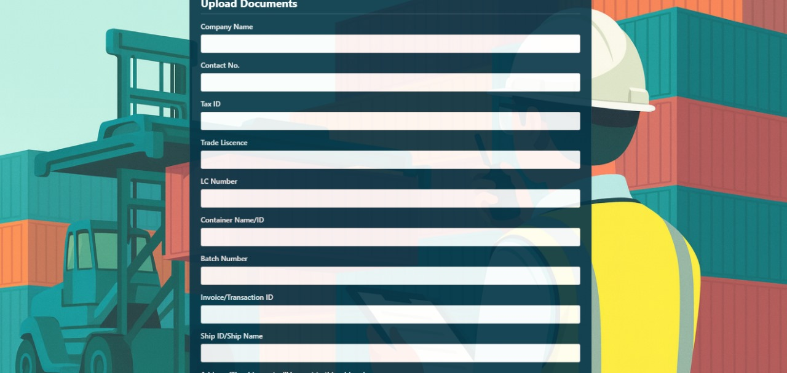
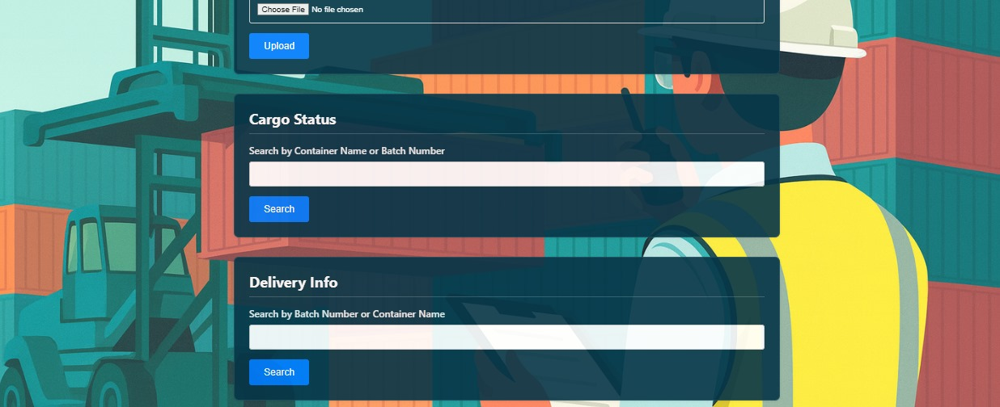

# NeoPort – Port Management System
**Stack:** PHP (XAMPP/Apache), MySQL/MariaDB, HTML/CSS/JS

NeoPort is a full-stack **Port Management System** that digitizes day-to-day port operations—**shipping requests**, **berth allocations**, **cargo assignments**, **logistics coordination**, and **role-based dashboards**—with **auditable activity logs** and **KPI cards** for decision makers.  
A standout capability is **map-based ship tracking**: **Importers/Exporters** can view a vessel’s **current / last-known location** on a map alongside request status, ETA windows, and berth assignments.

---

## Why NeoPort?
- **Operational clarity:** one system of record for requests, vessels, berths, and cargo.
- **Fewer errors:** structured workflows + foreign keys + validations.
- **Transparency:** **live location view** for Importers/Exporters reduces back-and-forth.
- **Extendable:** modular structure leaves room for notifications, APIs, analytics.

---

## Core Features

### 1) Shipping Requests & Approvals
- Create, submit, approve/reject with notes and timestamps.
- Status pipeline: *draft → submitted → review → approved/rejected → archived*.
- Attach vessel, cargo summary, requested berth window, and documents.

### 2) Berth Management & Scheduling
- Maintain **berth inventory** and allocate dock windows.
- Track **docked / departed**; prevent schedule clashes; monitor utilization.
- Director view shows conflicts, overlaps, and turnaround KPIs.

### 3) Cargo Assignments & Logistics
- Assign cargo to vessels/requests/berths; set handling priorities and storage locations.
- Track handling progress; connect to yard/warehouse movements (extensible).

### 4) Role-Based Dashboards

- **System Admin**
  - User/role management (RBAC), password resets, and access policies
  - System settings, audit controls, backups & maintenance

- **Port Director**
  - Executive KPIs, berth occupancy/utilization
  - Global vessel/berth schedule overview and conflict detection
  - Posts urgent notices and overviews port operations

- **Shipping Company (Agent)**
  - Create/manage **Shipping Requests**, upload documents, track approvals
  - Vessel schedule view, ETA windows, assigned berth slot
  - Updates **Live Ship Location** for their represented vessels

- **Harbor Master**
  - Port call register, pilotage coordination, docking/undocking clearances
  - Berth assignments; safety checks
  - Approve/rejects shipping requests

- **Customs & Compliance**
  - Document verification, flags/holds, risk notes
  - Visibility into request status and cargo declarations
  - Approves/rejects shipping, importer and exporter requests.

- **Cargo & Warehouse**
  - **Cargo Assignments**, storage slots, tally/hand-off records
  - Updates Yard/warehouse inventory according to containers and batches

- **Logistics & Transport**
  - Gate-in/out, trucking dispatch, yard moves, route scheduling
  - Assigns Transport according to approved requests
  - Updates cargo status which the importer/exporter can view.

- **Importer**
  - Own requests/shipments: status, approvals, documentation checklist
  - ETA and assigned berth window
  - **Live Ship Location** for their vessels

- **Exporter**
  - Booking/requests for outbound cargo, documentation
  - Vessel schedule for sailings
  - **Live Ship Location** for relevant vessels

### 5) **Live Ship Location (Map)**
- Map view (Leaflet/Google/Mapbox or equivalent) shows **current / last-known** ship position.
- Vessel markers link to **shipping requests, berth slots, and cargo**.
- Access controlled by role: Importer/Exporter can view only their own vessels.

### 6) KPIs, Search and Auditability
- KPI cards (pending approvals, occupied berths, departures today, etc.).
- Global search & filters (vessel, berth, request, date, status).

---

## Screenshots

| | | |
|---|---|---|
|  |  |  |
|  |  |  |
|  |  |  |
|  |  |  |
|  |  |  |
|  |  |  |

---

## Requirements
- **XAMPP** (Apache + MySQL/MariaDB)  
- **PHP** 7.4+  
- **MySQL/MariaDB** (default 3306; this project often uses **3307**—adjust as needed)

---

## Conclusion

NeoPort streamlines end-to-end port operations—from shipping requests and berth scheduling to cargo assignments and role-based oversight—while keeping an auditable record of every critical action. The built-in **live ship location** view gives Importers/Exporters and port staff shared situational awareness, reducing back-and-forth and improving decision speed.

## Future Work

- **Real-time vessel tracking:** Integrate AIS/third-party APIs for continuous position updates, geofencing, and ETA refinements.
- **Berth conflict solver:** Add automated scheduling heuristics (greedy / ILP) to flag and resolve time-window overlaps.
- **Notifications:** Email/SMS/WhatsApp alerts for approvals, berth changes, and geofence events.
- **Advanced analytics:** Dashboards for turnaround time, berth utilization, cargo dwell time, SLAs, demurrage forecasts.
- **Permissions & security:** Fine-grained RBAC, session hardening, CSRF protection, and activity-log integrity checks.
- **Data workflows:** Import/export of manifests; EDIFACT/EDI connectors for shipping partners.
- **API layer:** REST/JSON (later GraphQL) for mobile apps and partner integrations.
- **Operational UX:** Offline-capable PWA for yard tasks; barcode/QR support for cargo hand-offs.
- **Internationalization:** Multi-language UI; time-zone aware scheduling; multi-tenant (multi-port) support.
- **DevOps:** Docker compose for local dev, CI/CD pipeline, nightly backups, and repeatable DB migrations.
- **Testing:** Unit/integration tests and end-to-end UI tests to guard core workflows.

---

## Quick Start (Manual Download)

1. **Download the source**
   - Repo page → green **Code** → **Download ZIP**.
   - Extract; you’ll get `neoport-port-management-system-main` (or similar).

2. **Move to web root**
   - XAMPP → put the folder inside: `C:\xampp\htdocs\neoport-port-management-system`
   - (You can rename the folder; your URL changes accordingly.)

3. **Start XAMPP services**
   - Start **Apache** and **MySQL**.

4. **Create the database & import schema**
   - Open **phpMyAdmin**: `http://localhost/phpmyadmin`
   - Create database **`neoport`** (utf8mb4).
   - **Import** → choose `database/data.sql` → Go.
Finally, visit http://localhost/neoport-port-management-system in your browser
